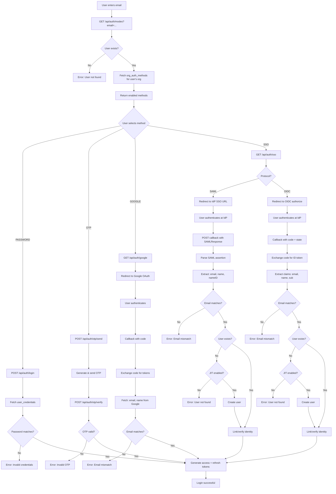

## Authentication Flow

```mermaid
flowchart TD
    A[User enters email] --> B[GET /api/auth/modes?email=...]
    B --> C{User exists?}
    C -->|No| D[Error: User not found]
    C -->|Yes| E[Fetch org_auth_methods for user's org]
    E --> F[Return enabled methods]
    F --> G{User selects method}
    
    G -->|PASSWORD| H[POST /api/auth/login]
    G -->|OTP| I[POST /api/auth/otp/send]
    G -->|GOOGLE| J[GET /api/auth/google]
    G -->|SSO| K[GET /api/auth/sso]
    
    %% Password flow
    H --> H1[Fetch user_credentials]
    H1 --> H2{Password matches?}
    H2 -->|No| H3[Error: Invalid credentials]
    H2 -->|Yes| Z[Generate tokens]
    
    %% OTP flow
    I --> I1[Generate & send OTP]
    I1 --> I2[POST /api/auth/otp/verify]
    I2 --> I3{OTP valid?}
    I3 -->|No| I4[Error: Invalid OTP]
    I3 -->|Yes| Z
    
    %% Google flow
    J --> J1[Redirect to Google OAuth]
    J1 --> J2[User authenticates]
    J2 --> J3[Callback with code]
    J3 --> J4[Exchange code for tokens]
    J4 --> J5[Fetch: email, name from Google]
    J5 --> J6{Email matches?}
    J6 -->|No| J7[Error: Email mismatch]
    J6 -->|Yes| Z
    
    %% SSO flow
    K --> K1{Protocol?}
    K1 -->|SAML| S1[Redirect to IdP SSO URL]
    K1 -->|OIDC| O1[Redirect to OIDC authorize]
    
    %% SAML
    S1 --> S2[User authenticates at IdP]
    S2 --> S3[POST callback with SAMLResponse]
    S3 --> S4[Parse SAML assertion]
    S4 --> S5[Extract: email, name, nameID]
    S5 --> S6{Email matches?}
    S6 -->|No| S7[Error: Email mismatch]
    S6 -->|Yes| S8{User exists?}
    S8 -->|No| S9{JIT enabled?}
    S9 -->|No| S10[Error: User not found]
    S9 -->|Yes| S11[Create user]
    S11 --> S12
    S8 -->|Yes| S12[Link/verify identity]
    S12 --> Z
    
    %% OIDC
    O1 --> O2[User authenticates at IdP]
    O2 --> O3[Callback with code + state]
    O3 --> O4[Exchange code for ID token]
    O4 --> O5[Extract claims: email, name, sub]
    O5 --> O6{Email matches?}
    O6 -->|No| O7[Error: Email mismatch]
    O6 -->|Yes| O8{User exists?}
    O8 -->|No| O9{JIT enabled?}
    O9 -->|No| O10[Error: User not found]
    O9 -->|Yes| O11[Create user]
    O11 --> O12
    O8 -->|Yes| O12[Link/verify identity]
    O12 --> Z
    
    Z[Generate access + refresh tokens] --> ZZ[Login successful]
```
